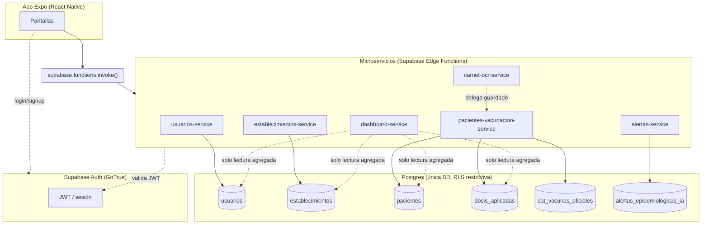

# Arquitectura de Microservicios — BioSafe

> Diseño de migración de BioSafe desde una app cliente-pesado (React Native hablando directo a Postgres vía RLS) hacia una arquitectura de microservicios basados en funciones (FaaS), manteniendo una única base de datos compartida.

## 1. Contexto: qué hay hoy

BioSafe hoy es una app Expo/React Native que usa `@supabase/supabase-js` para hablar **directo** con la base de datos Postgres desde las pantallas (`supabase.from('tabla').select()/insert()/update()`), protegida por Row Level Security (RLS). Solo dos piezas de lógica de servidor existen como Edge Functions:

- `extract-carnet` — recibe un PDF/imagen de cartilla física y usa IA (Groq) para extraer las dosis.
- `generate-alerts` — cron diario que genera alertas epidemiológicas (Google News RSS + Groq) y las guarda en `alertas_epidemiologicas_ia`.

Todo lo demás (crear usuarios, registrar pacientes, aplicar dosis, gestionar establecimientos, leer historiales) es lógica de negocio que vive **dispersa en 20+ pantallas**, cada una haciendo sus propias queries. No hay una capa de API: el "backend" es la combinación de RLS + lo que cada pantalla decide hacer.

**Tablas actuales** (todas en el schema `public` de una sola base Postgres):

| Tabla | Descripción |
|---|---|
| `usuarios` | Perfiles de todos los roles (tutor, personal de salud, admins) |
| `establecimientos` | Centros de salud / farmacias |
| `pacientes` | Niños/pacientes bajo control de vacunación |
| `dosis_aplicadas` | Registro de cada dosis aplicada a un paciente |
| `cat_vacunas_oficiales` | Catálogo oficial de vacunas del esquema PAI |
| `alertas_epidemiologicas_ia` | Alertas generadas por el cron de IA |

## 2. Decisión de arquitectura

Se eligió **microservicios basados en Edge Functions de Supabase** (FaaS) sobre **una sola base de datos compartida**, en vez de servicios contenedorizados (Node/Express + Docker) con bases separadas. Razones:

- **Base de datos compartida es un patrón legítimo de microservicios** cuando el sistema es de tamaño moderado y no necesita escalar cada dominio de forma independiente ni tolerar fallos de red entre bases. Evita el problema difícil de transacciones distribuidas / consistencia eventual entre servicios, que no aporta valor académico ni práctico aquí.
- **Supabase Edge Functions ya son microservicios reales**: son funciones Deno desplegadas de forma independiente, con su propio ciclo de vida, logs y variables de entorno — el mismo concepto que AWS Lambda o Cloudflare Workers, que sí se consideran arquitectura de microservicios en la industria (FaaS / "serverless microservices").
- Evita reconstruir desde cero cosas que Supabase ya resuelve bien: autenticación (Auth/GoTrue, que en sí mismo ya es un microservicio separado gestionado por Supabase), almacenamiento de archivos (Storage), y RLS como capa de defensa adicional.
- Aislamiento de dominio no requiere bases separadas: se logra con **un único "escritor" por dominio** (cada servicio es dueño de sus tablas) y contratos de API explícitos entre pantallas y servicios.

## 3. Dominios (bounded contexts) y servicios propuestos

Se identificaron 6 dominios a partir del código actual:



### 3.1 `usuarios-service`

**Dueño de:** `usuarios`
**Pantallas que migran:** LoginScreen (perfil post-login), RegisterScreen, CreateUserScreen, UserManagementScreen, AdminProfileScreen, HealthProfileScreen, HomeScreen (lectura de perfil)

**Acciones:**
| Acción | Quién puede llamarla | Qué hace |
|---|---|---|
| `registrarTutor` | público (recién autenticado vía Supabase Auth) | Crea la fila en `usuarios` con rol `Tutor_PersonaNormal` tras el `signUp` |
| `crearUsuarioStaff` | `AdminEstablecimiento`, `SuperAdmin` | Crea usuario de personal de salud/admin, usando `createTempClient()` para no cerrar sesión del admin actual |
| `obtenerPerfil` | cualquier autenticado | Devuelve el perfil propio |
| `actualizarPerfil` | cualquier autenticado (solo su propio registro) | Actualiza campos propios (`nombre_completo`, `tiene_hijos`) |
| `listarUsuarios` | `AdminEstablecimiento`, `SuperAdmin` | Lista usuarios (SuperAdmin: todos; AdminEstablecimiento: solo su establecimiento) |
| `contarUsuarios` | `AdminEstablecimiento`, `SuperAdmin` | Conteo escopado por rol (para dashboard) |
| `actualizarUsuario` | `AdminEstablecimiento`, `SuperAdmin` | Edita nombre/rol/establecimiento de otro usuario |
| `cambiarEstadoUsuario` | `AdminEstablecimiento`, `SuperAdmin` | Activa/desactiva la cuenta (bloquea acceso sin borrar historial) — usa la columna `usuarios.activo`, chequeada en `getAuthContext` |
| `eliminarUsuario` | `AdminEstablecimiento`, `SuperAdmin` | Borra perfil + cuenta de Auth. **Nunca permite eliminar un Tutor** (dejaría a sus hijos sin `id_tutor_registro`) — para tutores, usar `cambiarEstadoUsuario` |

Reglas comunes a `actualizarUsuario`/`cambiarEstadoUsuario`/`eliminarUsuario`: nadie puede actuar sobre su propia cuenta (evita auto-bloqueo), `AdminEstablecimiento` solo puede gestionar usuarios de su propio establecimiento, y nadie puede desactivar/eliminar a un `SuperAdmin`.

> Nota: el login (`signInWithPassword`) y el alta en Auth (`signUp`) **siguen usando el SDK de Supabase Auth directo** desde el cliente — Auth/GoTrue ya es un servicio separado y gestionado, no tiene sentido envolverlo. `usuarios-service` es responsable de todo lo que pasa *después*: la fila de perfil, roles, permisos.

### 3.2 `establecimientos-service`

**Dueño de:** `establecimientos`
**Pantallas que migran:** CreateEstablishmentScreen, EstablishmentListScreen

**Acciones:** `crear`, `listar`, `obtenerPorId`, `contarEstablecimientos`, `actualizar`, `eliminar`

Autorización: todo el CRUD es solo `SuperAdmin`; `AdminEstablecimiento` solo puede leer el propio (`obtenerPorId`). `eliminar` rechaza el borrado si el establecimiento todavía tiene usuarios asignados (`id_establecimiento` en `usuarios`) — hay que reasignarlos primero.

### 3.3 `pacientes-vacunacion-service` (el dominio central)

**Dueño de:** `pacientes`, `dosis_aplicadas`, `cat_vacunas_oficiales`
**Pantallas que migran:** FamilyScreen, ChildDetailScreen, HealthDashboardScreen, HealthProfileScreen (conteo), PatientsListScreen, PatientScanResultScreen, QRScannerScreen, QRScreen, QuickScanScreen, RegisterDoseScreen, CreateUserScreen (alta de paciente si el usuario nuevo es tutor), RegisterScreen (alta de paciente propio)

**Acciones:**
| Acción | Quién | Qué hace |
|---|---|---|
| `registrarPaciente` | tutor autenticado, o staff/admin dando de alta un tutor | Crea paciente + genera `codigo_qr_token` |
| `listarHijosDeTutor` | tutor | Lista de `pacientes` del tutor logueado |
| `obtenerProximaVacunaTutor` | tutor | Próxima dosis de refuerzo pendiente entre todos sus hijos |
| `obtenerPacientePorQR` | personal de salud/admin | Resuelve el QR escaneado a un paciente (`QRPayload` → `Paciente`) |
| `obtenerPaciente` | tutor (solo el propio) o personal/admin | Expediente completo con datos del tutor |
| `actualizarPaciente` | tutor (solo el propio) o personal/admin | Corrige nombre, fecha de nacimiento, sexo o embarazo |
| `listarPacientesAtendidosPorUsuario` | personal de salud/admin | Pacientes distintos atendidos por el caller, deduplicados |
| `registrarDosis` | personal de salud/admin | Inserta en `dosis_aplicadas`, valida contra `cat_vacunas_oficiales` |
| `actualizarDosis` | personal de salud/admin | Corrige fecha/lote/próxima cita de una dosis ya registrada |
| `eliminarDosis` | personal de salud/admin | Borra una dosis mal registrada |
| `listarDosisDePaciente` | tutor (solo sus hijos) o personal/admin | Historial + catálogo, en una sola llamada |
| `listarCatalogoVacunas` | cualquier autenticado | Catálogo de vacunas (lectura pública dentro de la app) |
| `crearVacunaCatalogo` / `actualizarVacunaCatalogo` | `SuperAdmin` | CRUD del esquema PAI (`VaccineCatalogScreen`) |
| `eliminarVacunaCatalogo` | `SuperAdmin` | Elimina una vacuna del catálogo — falla (409) si ya hay dosis aplicadas con ella (constraint RESTRICT) |
| `importarDosisDesdeCartilla` | tutor o personal/admin | Recibe las dosis ya extraídas por `carnet-ocr-service` y las inserta con `origen_registro: 'Migrado_Cartilla_Fisica'` |
| `obtenerEstadisticasAtencion` | personal de salud/admin | Dosis hoy/mes + últimas atenciones del caller (`HealthDashboardScreen`) |

Este es el servicio más grande porque concentra el core del negocio (vacunación). Es intencional: partirlo más fino (ej. separar "pacientes" de "dosis") generaría acoplamiento fuerte entre dos servicios que casi siempre se necesitan juntos (no se puede registrar una dosis sin el paciente, ni mostrar un paciente sin sus dosis) — dividirlos sería sobre-ingeniería.

### 3.4 `carnet-ocr-service` (ya existe como `extract-carnet`, se renombra y ajusta)

**No es dueño de tablas.** Es un servicio de procesamiento puro: recibe el PDF/imagen en base64, extrae texto, llama a Groq, devuelve `{ dosis: [...] }` estructurado. **Cambio respecto a hoy:** ya no debe ser `CarnetUploadModal.tsx` quien inserte directo en `dosis_aplicadas` (línea 252 actual) — ese guardado se delega a la acción `importarDosisDesdeCartilla` de `pacientes-vacunacion-service`, para que solo un servicio escriba esa tabla.

### 3.5 `alertas-service` (ya existe como `generate-alerts`, se separa lectura de escritura)

**Dueño de:** `alertas_epidemiologicas_ia`

- **Lado escritura (ya implementado):** el cron `generate-alerts` sigue igual, corriendo diario, usando `service_role` para insertar.
- **Lado lectura (nuevo):** se agrega la acción `listarActivas` / `listarCercanas(departamento)` para que `AlertsScreen` y `HomeScreen` dejen de leer la tabla directo y pasen por el servicio — así se puede, por ejemplo, aplicar lógica de negocio futura (paginación, priorización por nivel) sin tocar el cliente.

### 3.6 `dashboard-service` (nuevo)

**No es dueño de tablas.** Es el único servicio de **agregación de solo lectura** — compone estadísticas de `usuarios`, `establecimientos`, `pacientes` y `dosis_aplicadas` para `AdminDashboardScreen`. Se documenta como una excepción deliberada a la regla "un dominio, un dueño": en microservicios esto se conoce como **API Composition / CQRS de solo lectura**, un patrón estándar para pantallas de reporting que necesitan datos de varios dominios sin acoplar los servicios transaccionales entre sí.

## 4. Contrato de comunicación (estándar para todos los servicios)

Cada Edge Function expone **un único endpoint** con enrutamiento por `action` (patrón estándar en Supabase Edge Functions, que no soportan sub-rutas REST nativas sin un router manual):

```http
POST https://<project>.supabase.co/functions/v1/pacientes-vacunacion-service
Authorization: Bearer <jwt del usuario logueado>
Content-Type: application/json

{
  "action": "registrarDosis",
  "payload": { "id_paciente": "...", "id_vacuna": "...", "fecha_aplicacion": "..." }
}
```

**Respuesta estándar (éxito o error, mismo shape):**

```json
{ "ok": true, "data": { } }
{ "ok": false, "error": { "code": "forbidden", "message": "Solo personal de salud puede registrar dosis" } }
```

Cada función, en su primera línea de lógica:
1. Verifica el JWT del header `Authorization` contra Supabase Auth (usando el cliente admin) → obtiene `user.id`.
2. Busca el rol del usuario en `usuarios` (o lo recibe cacheado si se decide meterlo como custom claim en el JWT, mejora futura).
3. Autoriza según la acción pedida y el rol.
4. Ejecuta la operación con el cliente `service_role` (bypassa RLS — **la función es la autoridad de negocio**, no la RLS).
5. Devuelve el shape estándar.

Código compartido entre funciones (evita duplicar la validación de JWT/rol en cada una):

```
supabase/functions/_shared/
  cors.ts            → headers CORS estándar
  authContext.ts      → verifyJWT(req) => { userId, rol } | throws 401
  response.ts          → ok(data) / fail(code, message, status)
  supabaseAdmin.ts     → cliente con SUPABASE_SERVICE_ROLE_KEY
```

## 5. Base de datos: una sola Postgres, aislamiento lógico

- **Se mantiene una sola instancia** de Postgres (la actual de Supabase). No hay base por servicio.
- Cada tabla tiene **un solo servicio dueño** que la escribe (ver tabla de la sección 3). `dashboard-service` es la única excepción, y solo para lectura.
- **RLS pasa a ser defensa en profundidad, no la autorización primaria.** Hoy las policies de RLS son la única barrera; tras la migración, la autorización real vive en cada Edge Function. Se recomienda, en una fase final (sección 6, Fase 7), revocar los `GRANT` directos de `authenticated`/`anon` sobre las tablas y dejar policies restrictivas por defecto — así, aunque alguien intente leer/escribir la tabla saltándose las funciones (ej. con la anon key filtrada), RLS lo bloquea.
- No se requiere particionar en schemas distintos (`usuarios.*`, `salud.*`, etc.) — con RLS + funciones como único punto de escritura, el aislamiento lógico ya está garantizado sin la complejidad extra de cambiar schemas en todas las queries existentes.

## 6. Plan de migración (incremental, sin tiempo límite pero sin romper la app)

La app sigue funcionando en cada fase — no es un "big bang". Se migra pantalla por pantalla dentro de cada servicio, probando en cada paso.

| Fase | Qué se hace | Estado |
|---|---|---|
| **0** | Crear `supabase/functions/_shared/` (`cors.ts`, `response.ts`, `supabaseAdmin.ts`, `authContext.ts`, `handler.ts` con `defineService()`) y `src/services/_client.ts` (wrapper de `supabase.functions.invoke`) | ✅ Hecho |
| **1** | `pacientes-vacunacion-service` con las 10 acciones del contrato (sección 3.3) + `obtenerProximaVacunaTutor`. Migradas todas las pantallas que tocaban `pacientes`/`dosis_aplicadas`/`cat_vacunas_oficiales`: FamilyScreen, QRScreen, ChildDetailScreen, RegisterDoseScreen, PatientsListScreen, PatientScanResultScreen, QRScannerScreen, QuickScanScreen, HealthDashboardScreen (parte de vacunación), HomeScreen (parte de vacunación), RegisterScreen y CreateUserScreen (solo el alta de `pacientes`; el alta de `usuarios` queda para la Fase 2). También se adelantó `CarnetUploadModal` (ver Fase 4) | ✅ Hecho |
| **2** | `usuarios-service` — `obtenerPerfil`, `registrarTutor`, `crearUsuarioStaff`, `listarUsuarios`, `contarUsuarios`, `actualizarPerfil`. Migradas: LoginScreen, RegisterScreen, CreateUserScreen, UserManagementScreen, AdminProfileScreen, HealthProfileScreen, HomeScreen, HealthDashboardScreen, EstablishmentListScreen (solo la parte de perfil). `AdminDashboardScreen` queda para Fase 6 (usa `usuarios` + `pacientes` + `dosis_aplicadas` + `establecimientos` juntos) | ✅ Hecho |
| **3** | `establecimientos-service` — `crear`, `listar`, `obtenerPorId`, `contarEstablecimientos`. Migradas: CreateEstablishmentScreen, AdminProfileScreen, HealthProfileScreen, EstablishmentListScreen, CreateUserScreen | ✅ Hecho |
| **4** | `carnet-ocr-service` (reemplaza `extract-carnet`, ya eliminado de Supabase) con `defineService`. Se consolidaron ahí las dos acciones (`analizarPDF`, `analizarImagen`) — antes `CarnetUploadModal` llamaba a Groq directo desde el cliente para las imágenes, exponiendo la API key; ahora ambas pasan por el servidor con el secret `GROQ_API_KEY`. El guardado ya delegaba a `importarDosisDesdeCartilla` desde la Fase 1 | ✅ Hecho |
| **5** | `alertas-service` — `listarActivas`, `obtenerAlertaCercana`. Migradas: AlertsScreen, HomeScreen. El cron `generate-alerts` (lado escritura) sigue igual | ✅ Hecho |
| **6** | `dashboard-service` — `obtenerResumenAdmin` (compone usuarios+establecimientos+pacientes+dosis+catálogo, escopado por rol). Migrada: AdminDashboardScreen | ✅ Hecho |
| **7** | Cierre de seguridad: revocados los `GRANT` de `anon`/`authenticated` en las 7 tablas de negocio (`usuarios`, `establecimientos`, `pacientes`, `dosis_aplicadas`, `cat_vacunas_oficiales`, `cartillas_fisicas_imagenes`, `alertas_epidemiologicas_ia`) y RLS activado sin políticas (deny por defecto). Migración `20260825_lockdown_rls_microservicios.sql`, aplicada y verificada: la anon key ya no puede leer/escribir ninguna tabla directo (`permission denied for table pacientes`) | ✅ Hecho |

**Todas las fases completas (2026-08-25).** Cada fase se hizo como su propio despliegue verificado — la app quedó usable después de cada una, sin big-bang.

### Hallazgo de seguridad corregido en Fase 7

Antes de esta fase, **RLS estaba deshabilitado** en las 6 tablas de negocio (solo `alertas_epidemiologicas_ia` lo tenía) y `anon`/`authenticated` tenían permisos completos de INSERT/SELECT/UPDATE/DELETE/TRUNCATE sobre todas ellas — cualquiera con la anon key (pública, embebida en la app) podía leer o borrar `usuarios`/`pacientes` directo por REST, sin pasar por la app. Era una exposición real, no teórica, de datos de salud de menores. Se corrigió como parte natural del cierre de Fase 7, una vez confirmado que ningún código del cliente dependía ya de esos grants.

## 7. Estructura de carpetas final

```
supabase/
  functions/
    _shared/
      cors.ts
      authContext.ts
      response.ts
      supabaseAdmin.ts
    usuarios-service/
      index.ts
    establecimientos-service/
      index.ts
    pacientes-vacunacion-service/
      index.ts
    carnet-ocr-service/
      index.ts
    alertas-service/
      index.ts
    dashboard-service/
      index.ts
  migrations/
    ...

src/
  services/
    _client.ts                      (wrapper de invoke con manejo de errores estándar)
    usuarios.service.ts
    establecimientos.service.ts
    pacientesVacunacion.service.ts
    carnetOcr.service.ts
    alertas.service.ts
    dashboard.service.ts
  screens/
    ... (ya no importan `supabase` directo para queries de negocio,
         solo usan `src/services/*` — `supabase` del cliente queda
         reservado para Auth y Storage)
```

## 8. Cómo se defiende esto en la sustentación

- **Es microservicios reales, no "solo funciones sueltas"**: cada dominio tiene contrato de API propio, despliegue independiente (`supabase functions deploy <nombre>`), logs independientes, y un único dueño de sus datos — los tres pilares de microservicios (autonomía, límites de dominio claros, comunicación por contrato) están presentes.
- **La base de datos compartida es una decisión justificada, no una limitación**: se documenta explícitamente por qué (evitar transacciones distribuidas sin necesidad real de escalar independientemente cada dominio), citando el patrón "shared database" como válido para sistemas de este tamaño.
- **Hay un patrón de composición documentado** (`dashboard-service`) que muestra conocimiento de los problemas reales de microservicios (agregación entre dominios) y su solución estándar (CQRS de lectura / API composition).
- **RLS + autorización en la función = defensa en profundidad**, un concepto de seguridad real y verificable en el código.

## 9. Estado final (2026-08-25)

**Las 8 fases (0–7) están completas, desplegadas y verificadas.** Los 6 microservicios corren en producción:

```
supabase functions list --project-ref pndqvugenrexsgqobxrd
```

- `usuarios-service`
- `pacientes-vacunacion-service`
- `establecimientos-service`
- `carnet-ocr-service`
- `alertas-service`
- `dashboard-service`
- `generate-alerts` (cron, sin cambios)

**Cero acceso directo a tablas desde el cliente** — verificado con un barrido de todo `src/` (`.from('usuarios'|'pacientes'|'dosis_aplicadas'|'cat_vacunas_oficiales'|'establecimientos'|'alertas_epidemiologicas_ia')`, cero resultados) y con RLS/grants a nivel de base de datos (sección 6, Fase 7).

### Para seguir desarrollando

- **Nuevas features de un dominio ya migrado**: agregar la acción al `index.ts` del servicio correspondiente (patrón `defineService`, ver sección 4), el método al `.service.ts` del cliente, y volver a desplegar con `supabase functions deploy <nombre> --project-ref pndqvugenrexsgqobxrd`.
- **Nuevo dominio**: seguir el mismo patrón — carpeta en `supabase/functions/`, `defineService({...})`, y su `.service.ts` en `src/services/`. No hace falta tocar `_shared/`.
- **No reabrir el acceso directo a las tablas.** Si algo nuevo necesita leer/escribir una tabla, pasa por su servicio dueño (sección 3) — nunca `supabase.from(...)` desde una pantalla.
